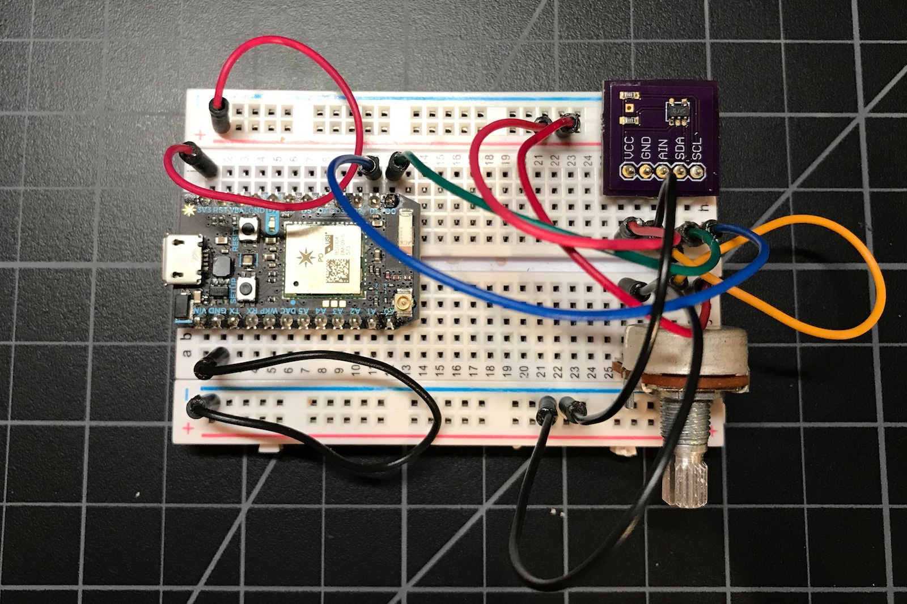
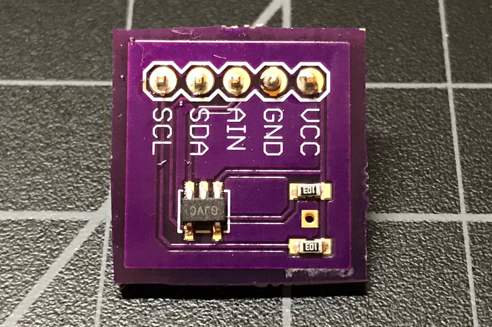

# MCP3021-RK

*Particle library for MCP3021 I2C 10-bit ADC*

I'm not sure why you'd need this, as the Particle Photon and Electron already have a lot of ADC inputs. I originally did this because I thought I might need an ADC at the end of a long-range I2C bus, but you never know when you might need it so here it is.

The Microchip MCP3021 is a tiny (SOT-23-5), inexpensive (US$1.12 in single quantities) 10-bit ADC with an I2C interface. It operates on from 2.7V to 5.5V, which can also be handy.

I got mine from [Digikey](https://www.digikey.com/product-detail/en/microchip-technology/MCP3021A5T-E-OT/MCP3021A5T-E-OTCT-ND/1979808) but they're widely available.

One issue is that it's only available in the SMT SOT-23-5 package, so it's intended to be included directly on your board. For prototyping, you could use a SOT-23-5 breakout, or build your own. 

I built a tiny circuit board for this purpose that contains the chip and two I2C pull-up resistors. The Eagle CAD schematic and layout are included in the eagle directory.





This ADC is fast - it samples during the I2C transaction, so you can call it as often as you want.

## Sample program

Here's a simple sample program to read the ADC:

```
#include "Particle.h"

#include "MCP3021-RK.h"

const unsigned long SAMPLE_PERIOD_MS = 1000;

MCP3021 adc(Wire);
bool haveChip = false;
unsigned long lastSample = 0;


void setup() {
	Serial.begin(9600);
	adc.begin();
}

void loop() {
	if (millis() - lastSample >= SAMPLE_PERIOD_MS) {
		lastSample = millis();

		if (!haveChip) {
			haveChip = adc.check();
			Serial.printlnf("haveChip=%d", haveChip);
		}
		if (haveChip) {
			Serial.printlnf("value=%u", adc.getSample());
		} else {
			Serial.println("no MCP3021 detected");
		}
	}
}

```
